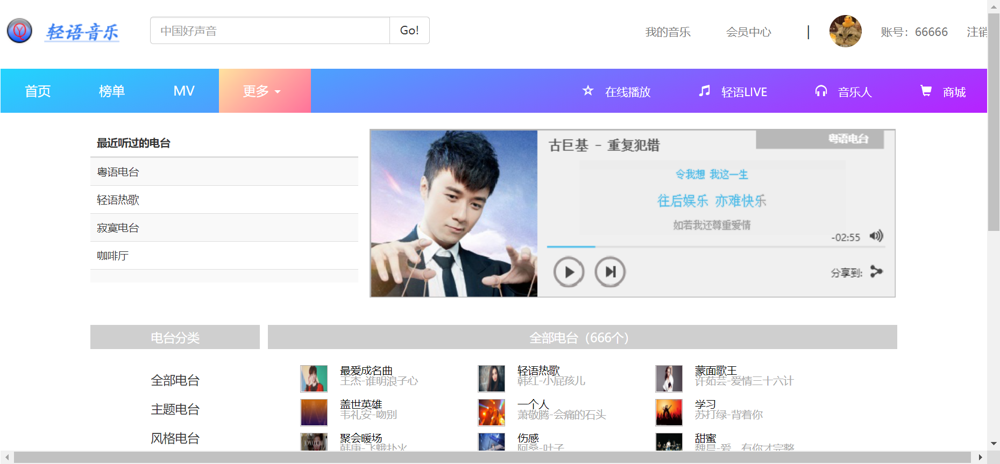
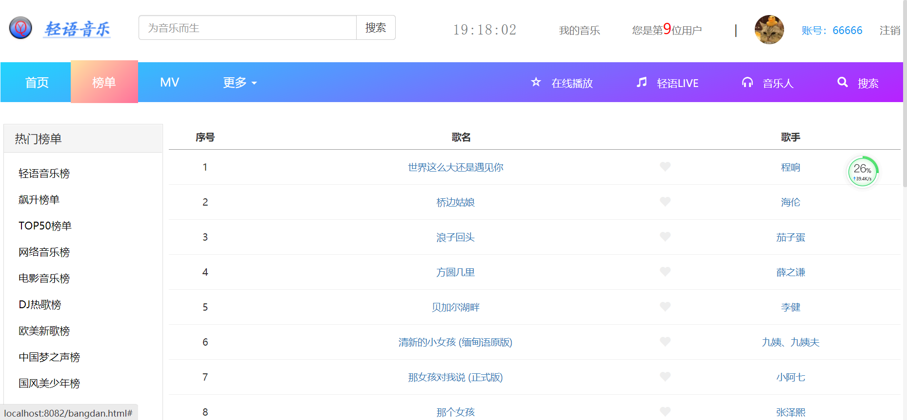
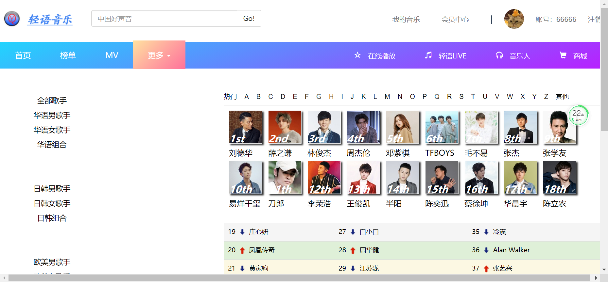
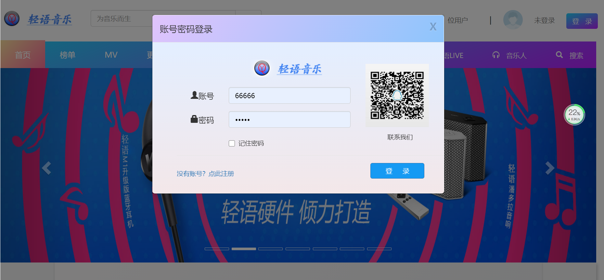
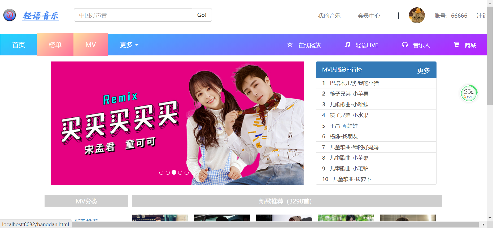

# 基于ssm的轻语音乐网网站

#### 介绍
基于ssm的轻语音乐网网站，前端采用html+bootstrap，主要分两端Web端与管理后端，代码规范整洁，技术选型也非常经典，合适初学java编程者学习以及计算机专业学生。

#### 软件架构
前端：html | jquery | bootstrap  
后端：spring | springmvc | mybatis  
环境：jdk1.8 | maven | mysql | tomcat      

#### 功能介绍

##### 【功能详述】 

- 音乐详情

    

- 更多音乐

    

- 音乐榜单

    

- 歌单推荐

    

- 歌手列表

    

- 系统登陆

    

- MV首页

    

#### 使用说明
1. 创建数据库，执行数据库脚本  
2. 修改jdbc数据库连接参数  
3. 下载安装maven依赖jar  
4. 启动SpringBoot启动类  

#### 后端管理

请求地址： http://localhost:8080/

用户名：admin

密码：123456   